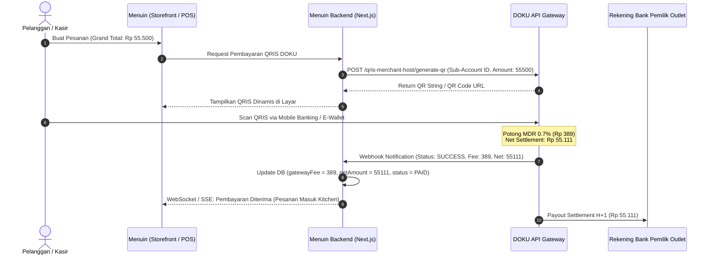

# Menuin Payment Gateway Migration: Source of Truth (Midtrans to DOKU)

Dokumen ini merupakan **panduan sumber kebenaran (*Source of Truth*)** teknis dan arsitektural untuk proses migrasi payment gateway Menuin dari **Midtrans** ke **DOKU**. Dokumen ini dirancang sebagai acuan tetap saat pendaftaran akun DOKU Anda telah selesai dan siap diintegrasikan.

---

## 1. Latar Belakang & Alasan Strategis Migrasi

### 1.1 Keterbatasan Midtrans untuk Model Multi-Tenant SaaS
* **Struktur Akun Tunggal (*Single-Merchant Bound*):** Midtrans Snap secara *default* mengikat seluruh pembayaran ke satu akun utama merchant (*Master Merchant*).
* **Fitur Sub-Account Terbatas:** Fitur split pembayaran atau pengelolaan sub-merchant (*Marketplace/Multi-Tenant*) di Midtrans memerlukan persetujuan khusus (*Enterprise Iris Payout*) yang rumit, tidak fleksibel, dan memiliki biaya per transfer terpisah yang membebani UMKM.
* **Kebutuhan Menuin:** Sebagai platform SaaS F&B multi-outlet, Menuin membutuhkan arsitektur di mana setiap outlet/tenant dapat memiliki rekening penampungan *settlement* sendiri atau dana hasil transaksi QRIS dapat dipisahkan secara otomatis per outlet tanpa campur aduk.

### 1.2 Mengapa DOKU Lebih Unggul untuk Menuin?
1. **DOKU Sub-Account / Multi-Tenant Ready:** DOKU mendukung hierarki *Aggregator / Marketplace* yang memungkinkan Menuin mendaftarkan *Sub-Account* untuk tiap cabang/outlet.
2. **Dukungan QRIS Dinamis Asli (*Native Dynamic QRIS*):** DOKU menyediakan API pembuatan QRIS Dinamis langsung per pesanan (*per transaction*) yang dapat di-scan oleh seluruh aplikasi perbankan (BCA, Mandiri, BRI, BNI) dan e-wallet (GoPay, OVO, Dana, ShopeePay).
3. **MDR Standar Regulasi Bank Indonesia:** Mendukung tarif resmi BI sebesar **0.7%** dengan pemotongan langsung di awal (*Nett Settlement*), sehingga dana yang ditransfer ke rekening pemilik outlet sudah bersih.

---

## 2. Arsitektur Integrasi DOKU QRIS Dinamis Menuin



---

## 3. Spesifikasi Teknis API DOKU (Jokul / DOKU API v2)

### 3.1 Endpoint Server DOKU
| Lingkungan | Base URL |
| :--- | :--- |
| **Sandbox (Uji Coba)** | `https://api-sandbox.doku.com` |
| **Production (Live)** | `https://api.doku.com` |

### 3.2 Header Otentikasi & Keamanan (DOKU Signature)
Setiap panggilan API ke DOKU wajib menyertakan 4 header standar:
* `Client-Id`: Diberikan oleh DOKU Dashboard.
* `Request-Id`: UUID unik untuk setiap request (mencegah *replay attack*).
* `Request-Timestamp`: Format ISO 8601 UTC (contoh: `2026-09-28T05:00:00Z`).
* `Signature`: `HMAC-SHA256` dari komponen request yang di-hash menggunakan `Secret-Key`.

Rumus Signature DOKU:
```
ComponentToSign = "Client-Id:" + clientId + "\n" +
                  "Request-Id:" + requestId + "\n" +
                  "Request-Timestamp:" + requestTimestamp + "\n" +
                  "Request-Target:" + targetPath + "\n" +
                  "Digest:" + Base64(SHA256(requestBody));
Signature = Base64(HMAC-SHA256(secretKey, ComponentToSign));
```

---

## 4. Pemetaan Skema Database Menuin untuk DOKU

Tabel database Menuin telah diperbarui dan siap digunakan:

### 4.1 Tabel `tenants` (Kredensial Gateway Outlet)
* `dokuClientId`: Client ID dari dasbor DOKU.
* `dokuSecretKey`: Secret Key / Shared Key DOKU.
* `dokuSubAccountId`: ID Sub-Account outlet (jika menggunakan fitur multi-tenant aggregator).
* `dokuEnvironment`: `'sandbox'` (saat tes) atau `'production'` (saat live).

### 4.2 Tabel `transactions` (Pencatatan MDR & Saldo Riil)
* `grandTotal`: Total yang dibayarkan pelanggan di struk (termasuk PB1 jika ada).
* `gatewayFee`: Potongan biaya MDR gateway (0.7% atau nilai riil dari webhook DOKU).
* `netAmount`: Saldo riil masuk kas/rekening (`grandTotal - gatewayFee`).
* `paymentMethod`: `'QRIS'` / `'DOKU'`.
* `paymentStatus`: `'PENDING'` $\rightarrow$ `'PAID'`.

---

## 5. Webhook Notification DOKU (`/api/webhook/doku`)

DOKU akan mengirimkan notifikasi HTTP POST ke URL Menuin saat pelanggan menyelesaikan pembayaran QRIS:

```json
{
  "service": {
    "id": "QRIS"
  },
  "acquirer": {
    "id": "DOKU"
  },
  "order": {
    "invoice_number": "TRX-244ae4d4-0012",
    "amount": 55500
  },
  "transaction": {
    "status": "SUCCESS",
    "date": "2026-09-28T05:15:00Z",
    "original_request_id": "req-uuid-1234"
  },
  "additional_info": {
    "fee_amount": 389,
    "net_amount": 55111,
    "sub_account_id": "SUB-OUTLET-01"
  }
}
```

### Logika Penanganan Webhook:
1. Verifikasi header `Signature` dari DOKU menggunakan `tenant.dokuSecretKey`.
2. Jika status adalah `SUCCESS`:
   * Set `paymentStatus = 'PAID'`.
   * Set `gatewayFee = payload.additional_info.fee_amount` (atau `Math.round(amount * 0.007)`).
   * Set `netAmount = payload.additional_info.net_amount` (atau `amount - gatewayFee`).
   * Teruskan pesanan ke antrean kasir / dapur (*kitchen display*).
   * Catat bukti di tabel `payments`.

---

## 6. Checklist Pendaftaran & Aktivasi Akun DOKU

Ketika Anda siap mendaftar ke DOKU, berikut tahapan yang perlu dilalui:

1. **Pendaftaran Akun Bisnis DOKU:**
   * Kunjungi portal pendaftaran: [doku.com/bisnis](https://www.doku.com).
   * Pilih tipe akun: **Bisnis / Korporasi / Platform**.
2. **Dokumen Persyaratan:**
   * KTP Pemilik / Direktur.
   * NPWP Pribadi atau Badan Usaha.
   * NIB (Nomor Induk Berusaha) / Izin Usaha Restoran/F&B.
   * Buku Tabungan / Rekening Koran untuk pencairan dana settlement.
3. **Pengajuan Fitur Sub-Account & QRIS:**
   * Ajukan permohonan fitur **QRIS Dinamis API** dan **Sub-Account Aggregator** kepada Account Manager DOKU.
4. **Penyambungan ke Menuin:**
   * Salin `Client ID` dan `Secret Key` dari DOKU Dashboard.
   * Masukkan ke menu **Pengaturan Toko &rarr; Integrasi Pembayaran** di Menuin.
   * Masukkan Notification URL Webhook di DOKU Dashboard:  
     `https://app.menuin.id/api/webhook/doku`.
5. **Uji Coba Sandbox:**
   * Lakukan simulasi scan QRIS menggunakan simulator pembayaran DOKU.
   * Verifikasi bahwa `gatewayFee` (0.7%) dan `netAmount` tercatat sempurna pada laporan Menuin.
6. **Aktivasi Production (Live):**
   * Ubah environment menjadi `production`.
