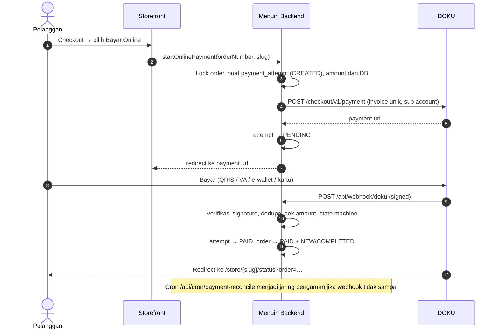

# Menuin × DOKU — Source of Truth Integrasi Pembayaran

Dokumen acuan teknis integrasi DOKU di Menuin. Isinya mengikuti kode yang sudah
ada di repo; bila ada perbedaan, **kode adalah sumber kebenaran** dan dokumen ini
harus diperbarui.

---

## 1. Keputusan arsitektur

| Keputusan | Pilihan | Alasan |
|---|---|---|
| Model akun | **Platform + Sub Account** (Model A) | Menuin memegang satu kredensial DOKU (env). Tiap outlet cukup punya `doku_sub_account_id`, tidak ada secret per tenant di DB. |
| Produk untuk pesanan online (storefront) | **DOKU Checkout** (hosted page, Non-SNAP) | Satu integrasi untuk QRIS, VA, e-wallet, dan kartu. |
| Langganan Menuin | **DOKU Checkout** ke akun platform (tanpa Sub Account) | Mesin pembayaran sama dengan storefront. Harga ditentukan server (`lib/billing/plans.ts`). |
| POS QRIS dinamis | **SNAP QRIS MPM** (Fase 3) | Kasir butuh QR string mentah. Checkout hanya memberi URL. |
| Lingkungan | **Sandbox dulu** sampai semua fase selesai | Pindah ke production cukup dengan mengganti env. |

## 2. Status fase

| Fase | Isi | Status |
|---|---|---|
| 1 | Modul `lib/payments`, migrasi DB, Checkout storefront, webhook, cron rekonsiliasi, aktivasi Sub Account | ✅ Selesai (menunggu uji live di sandbox) |
| 2 | Langganan Menuin via DOKU (menggantikan `/api/checkout` + webhook Midtrans subscription) | ✅ Selesai (menunggu uji live di sandbox) |
| 3 | POS QRIS dinamis via SNAP (RSA key pair, token B2B, notifikasi SNAP) | ✅ Selesai (menunggu uji live di sandbox) |
| 4 | Antrean review, pencatatan refund, import settlement (fee riil) | ✅ Selesai |

## 3. Alur pembayaran (Fase 1)



### Alur langganan (Fase 2)

1. OWNER yang terkunci membuka `PaymentGate` dan memilih paket, lalu masuk ke `/checkout?plan=starter|business`. Halaman ini wajib login.
2. `startSubscriptionCheckout(planCode)` membuat atau memakai ulang tagihan `subscription_invoices` (PENDING). Harga diambil dari katalog server. Ganti paket membatalkan tagihan lama.
3. `startSubscriptionPayment` membuat attempt `SUB-…` (`purpose = SUBSCRIPTION`) ke DOKU Checkout **tanpa Sub Account**, sehingga dana masuk ke akun platform. Batas bayar 60 menit.
4. Webhook `/api/webhook/doku` (endpoint yang sama dengan order) menjalankan `applySubscriptionPaid`:
   - langganan ACTIVE lama menjadi EXPIRED;
   - langganan ACTIVE baru dibuat, periode = sekarang + 30 hari + sisa hari langganan lama;
   - invoice menjadi PAID;
   - `tenants.subscription_tier` diperbarui.
5. DOKU mengarahkan pengguna ke `/checkout/status?invoice=…`. Halaman ini melakukan polling `getSubscriptionCheckoutStatus`, dengan fallback Check Status yang dibatasi.
6. `getEntitlements` mengunci dashboard bila `currentPeriodEnd` sudah lewat.

### Alur QRIS dinamis POS (Fase 3)

1. Kasir memilih **QR Dinamis**. Opsi ini aktif hanya bila konfigurasi SNAP dan merchant QRIS outlet tersedia (`getPosQrisAvailability`).
2. `startPosQrisCheckout`:
   - menyimpan transaksi POS sebagai `PENDING` (`paymentMethod = QRIS_DYNAMIC`) dan langsung memotong stok;
   - memanggil `startPosQrisPayment`, yang membuat attempt `QRS-…` (`product = SNAP_QRIS`);
   - memanggil DOKU `qr-mpm-generate` dengan nominal dari DB dan masa berlaku 10 menit.
3. Layar kasir (`QrisPaymentDialog`) menampilkan QR dan melakukan polling `getPosQrisStatus` setiap 3 detik. Pengecekan ke DOKU (`qr-mpm-query`) dibatasi atomik, maksimal satu per 3 detik per transaksi.
4. Saat lunas, transaksi menjadi `PAID` + `PROCESSING` (masuk dapur seperti POS biasa), fee estimasi tercatat, lalu struk tampil.
5. **Batalkan:** status dicek ke DOKU dulu. Kalau sudah dibayar, pembatalan ditolak. Kalau belum, transaksi menjadi `CANCELLED` dan stok dikembalikan.
6. **QR kedaluwarsa:** status dicek dulu, baru QR baru dibuat untuk transaksi yang sama.
7. **Notifikasi SNAP dari DOKU:**
   - DOKU meminta token ke `POST /api/snap/v1.0/access-token/b2b`. Signature RSA-nya diverifikasi dengan `DOKU_PUBLIC_KEY`, lalu kita menerbitkan JWT RS256.
   - DOKU mengirim `POST /api/snap/v1.0/qr/qr-mpm-notify` dengan bearer JWT tersebut.
   - Isi status di body notifikasi **tidak dipercaya**. Notifikasi hanya memicu `qr-mpm-query` yang ditandatangani.

### Operasional pembayaran (Fase 4)

Halaman **Pengaturan → Transaksi Online** (`/outlet/{key}/settings/online-payments`, untuk OWNER dan MANAGER):

- **Perlu Ditinjau**: pembayaran yang ditandai sistem (`requires_review`), lengkap dengan penjelasan dan saran tindakan per alasan (`lib/payments/review-reasons.ts`).
- **Catat Refund**: refund dieksekusi di dashboard DOKU, lalu dicatat di sini (nominal, nomor referensi, catatan). Satu refund per pembayaran, dengan lock dan pengecekan ulang supaya tidak tercatat ganda.
  - Refund penuh atas pembayaran yang melunasi order mengubah `transactions.payment_status` menjadi `REFUNDED`.
  - Refund pembayaran ganda tidak mengubah order, karena order tetap lunas lewat metode lain.
- **Selesai Tanpa Refund**: wajib menyertakan catatan. Contohnya pembayaran telat untuk pesanan yang tetap dilayani.
- **Import settlement (OWNER)**: unggah CSV dari dashboard DOKU.
  - Kolom dikenali dari nama header (invoice, amount, fee, net amount, settlement date). Format rupiah Indonesia didukung.
  - Fee estimasi diganti fee riil (`fee_source = SETTLEMENT`), dan `transactions.gateway_fee`/`net_amount` ikut diperbarui. Laporan keuangan otomatis akurat.
  - Invoice milik outlet lain, belum lunas, atau nominalnya tidak cocok dilaporkan dan tidak diterapkan.
  - Idempoten: unggah ulang file yang sama tidak mengubah apa pun.

Refund lewat API DOKU dan penarikan laporan settlement otomatis lewat API **belum** diimplementasikan, karena spesifikasi API-nya belum bisa diverifikasi. Kandidat langkah setelah uji live.

## 4. Peta kode

| File | Fungsi |
|---|---|
| `apps/web/src/lib/payments/doku/config.ts` | Membaca env dan memvalidasinya dengan zod. Fail-closed: tanpa kredensial, pembayaran online nonaktif. |
| `apps/web/src/lib/payments/doku/signature.ts` | Signature Non-SNAP (HMAC-SHA256 + Digest) dengan perbandingan constant-time. |
| `apps/web/src/lib/payments/doku/client.ts` | HTTP client: timeout, `Request-Id` unik, error API vs network (outcome unknown). |
| `apps/web/src/lib/payments/doku/checkout.ts` | Create Checkout dan Check Status. |
| `apps/web/src/lib/payments/doku/sub-account.ts` | Membuat Sub Account outlet. |
| `apps/web/src/lib/payments/doku/notification.ts` | Parsing header dan payload webhook. |
| `apps/web/src/lib/payments/state-machine.ts` | Aturan transisi status (murni, diuji unit). |
| `apps/web/src/lib/payments/payment.service.ts` | Create (order dan langganan), apply outcome, sync, webhook, dan rekonsiliasi. Satu-satunya pintu ke DB pembayaran. |
| `apps/web/src/lib/billing/plans.ts` | Katalog paket langganan: satu-satunya sumber harga. |
| `apps/web/src/lib/actions/billing.ts` | Server action checkout langganan (OWNER saja) dan status tagihan. |
| `apps/web/src/app/checkout/` | Halaman checkout langganan dan `/checkout/status`. |
| `apps/web/src/lib/payments/doku/snap/` | SNAP: config (validasi key, menolak public key DOKU yang tertukar), signature (RSA/HMAC-SHA512), client (token B2B ter-cache, retry 401), QRIS generate/query, token inbound. |
| `apps/web/src/lib/pos/create-pos-transaction.ts` | Pembuatan transaksi POS (lunas langsung / menunggu gateway) dan restock. |
| `apps/web/src/lib/actions/pos-qris.ts` | Server action QRIS POS: mulai, status, QR baru, batal, ketersediaan. |
| `apps/web/src/features/pos/components/qris-payment-dialog.tsx` | Layar QR untuk kasir. |
| `apps/web/src/app/api/snap/v1.0/...` | Endpoint SNAP inbound: token B2B dan notifikasi QRIS. |
| `apps/web/src/lib/payments/settlement.ts` | Parser CSV settlement (murni): deteksi kolom dan parsing rupiah. |
| `apps/web/src/lib/payments/payment-ops.service.ts` | Daftar pembayaran, refund, penyelesaian review, dan penerapan settlement. |
| `apps/web/src/lib/actions/online-payments.ts` + `app/outlet/[outletKey]/settings/online-payments/` | Server action (dengan cek peran) dan halaman Transaksi Online. |
| `apps/web/src/app/api/webhook/doku/route.ts` | Endpoint notifikasi DOKU. |
| `apps/web/src/app/api/cron/payment-reconcile/route.ts` | Endpoint cron rekonsiliasi. |
| `apps/web/drizzle/doku_payments.sql`, `doku_subscriptions.sql`, `doku_qris.sql`, `doku_ops.sql` + `scripts/migrate-doku-payments.mjs` | Migrasi DB (idempotent, dijalankan berurutan). |

## 5. Spesifikasi DOKU yang dipakai

**Base URL:** sandbox `https://api-sandbox.doku.com`, production `https://api.doku.com`.

**Signature Non-SNAP** (untuk request keluar maupun webhook masuk):
```
Component = "Client-Id:{id}\nRequest-Id:{rid}\nRequest-Timestamp:{ts}\nRequest-Target:{path}"
            + "\nDigest:{base64(sha256(rawBody))}"   (hanya jika ada body)
Signature = "HMACSHA256=" + base64(HMAC-SHA256(secretKey, Component))
```
- `Request-Timestamp`: ISO-8601 UTC tanpa milidetik, contoh `2026-09-30T08:00:00Z`.
- Untuk webhook, `Request-Target` = **path notification URL milik Menuin** (`DOKU_NOTIFICATION_PATH`, default `/api/webhook/doku`).
- Digest dihitung dari **body mentah**. Body tidak boleh di-parse lalu di-stringify ulang sebelum diverifikasi.

**Endpoint:**
| Aksi | Endpoint |
|---|---|
| Buat pembayaran | `POST /checkout/v1/payment`, lalu ambil `response.payment.url` |
| Cek status | `GET /orders/v1/status/{invoice_number}`, lalu baca `transaction.status` |
| Buat Sub Account | `POST /sac-merchant/v1/accounts`, lalu ambil `account.id` (`SAC-…`) |
| Routing dana ke outlet | tambahkan `additional_info.account.id = "SAC-…"` di request Checkout |

**Pemetaan status:** `SUCCESS → PAID`, `PENDING → PENDING`, `FAILED → FAILED`, `EXPIRED → EXPIRED`. Status lain diabaikan.

## 5a. Verifikasi terhadap Postman collection resmi DOKU

Sumber: [`doku-postman-collection.json`](https://raw.githubusercontent.com/PTNUSASATUINTIARTHA-DOKU/doku-postman-collection/main/doku-postman-collection.json).

| Bagian | Hasil |
|---|---|
| Checkout `POST /checkout/v1/payment` | ✅ Signature (Digest base64 SHA-256, `HMACSHA256=` + base64 HMAC-SHA256, timestamp `toISOString().slice(0,19)+"Z"`) dan bentuk body cocok |
| Check Status `GET /orders/v1/status/{invoice}` | ✅ Signature tanpa Digest, cocok |
| Create Sub Account `POST /sac-merchant/v1/accounts` | ✅ Body `{account:{email,type:"STANDARD",name}}` cocok |
| Token B2B `POST /authorization/v1/access-token/b2b` | ✅ Header `X-CLIENT-KEY`/`X-TIMESTAMP`/`X-SIGNATURE` (SHA256withRSA `clientId\|timestamp`), body `grantType` cocok |
| Signature simetris SNAP | ✅ HMAC-SHA512 base64 atas `METHOD:path:token:lowerhex(sha256(minify(body))):timestamp` cocok |
| `CHANNEL-ID` | ⚠️ **Diperbaiki.** DOKU memakai kode seperti `H2H`/`VA008`, bukan angka 5 digit. Default sekarang `H2H` |
| QRIS MPM generate/query, refund Checkout, settlement report | ❌ Tidak ada di collection. Masih berdasarkan library resmi dan standar SNAP, perlu dikonfirmasi saat uji live |

Catatan: collection juga memuat **Sub Account V2** (`/sub-account/v2.0/register`, SNAP-style dengan `parentProfileId` = Client ID). Implementasi saat ini memakai V1, yang ID `SAC-…`-nya dipakai di `additional_info.account.id` Checkout. Pindah ke V2 hanya bila DOKU mensyaratkannya.

## 5b. Spesifikasi SNAP (QRIS)

Format berikut diverifikasi dari library resmi `doku-nodejs-library`:

| Bagian | Format |
|---|---|
| Timestamp | `yyyy-MM-ddTHH:mm:ss+07:00` |
| Token B2B (keluar) | `POST /authorization/v1/access-token/b2b`. Header `X-CLIENT-KEY`, `X-TIMESTAMP`, `X-SIGNATURE = base64(SHA256withRSA(privateKey, clientId + "\|" + timestamp))`. Body `{"grantType":"client_credentials"}` |
| Request transaksi | Header `Authorization: Bearer`, `X-TIMESTAMP`, `X-PARTNER-ID`, `X-EXTERNAL-ID` (numerik unik), `CHANNEL-ID`, `X-SIGNATURE = base64(HMAC-SHA512(secretKey, METHOD:path:token:lowerhex(sha256(body)):timestamp))` |
| QRIS | `POST /snap-adapter/b2b/v1.0/qr/qr-mpm-generate` dan `/qr-mpm-query` (`serviceCode = 47`). `latestTransactionStatus`: `00` lunas, `01`–`03` pending, `05`/`06` gagal, `04`/`07` diabaikan |

**Perlu dikonfirmasi saat uji live:** nilai `CHANNEL-ID` untuk QRIS (default `H2H`, mengikuti request Direct API di Postman collection DOKU), field wajib `additionalInfo` pada generate, dan cara DOKU memetakan merchant QRIS per Sub Account (saat ini dipakai `tenants.doku_qris_merchant_id`/`doku_qris_terminal_id`).

## 6. Data

**`payment_attempts`**: satu baris per percobaan bayar, untuk order maupun langganan.
- `purpose` bernilai `ORDER` (mengisi `transaction_id`) atau `SUBSCRIPTION` (mengisi `subscription_invoice_id`). CHECK constraint menjamin tepat satu yang terisi.
- `invoice_number` unik per attempt. Formatnya `MNU-{time36}-{rand}` untuk order dan `SUB-…` untuk langganan.
- `amount` berupa integer rupiah.
- Status: `CREATED → PENDING → PAID | FAILED | EXPIRED | CANCELED`.
- Unique index parsial menjamin **maksimal satu attempt aktif per order / per tagihan**.
- Kolom review: `requires_review` dan `review_reason` (`LATE_PAYMENT`, `ALREADY_PAID_OTHER_METHOD`, `ORDER_CLOSED_BEFORE_PAYMENT`, `AMOUNT_MISMATCH`, `SUB_ACCOUNT_MISMATCH`).
- `fee_amount`/`net_amount` untuk sementara berupa estimasi (`fee_source = ESTIMATED`, 0,7%) sampai rekonsiliasi settlement di Fase 4.

**`subscription_invoices`**: tagihan langganan.
- Kolom: `plan_code`, `plan` (BASIC/PRO), `amount`, `period_days`, `status` (`PENDING → PAID | CANCELED`), serta `subscription_id`, `period_start`, dan `period_end` setelah lunas.
- Unique index parsial: **maksimal satu tagihan PENDING per tenant**.

**`payment_attempts` (QRIS)**: `product = SNAP_QRIS`, `qr_content`, `gateway_merchant_id` (dipakai untuk query), `provider_reference` (`referenceNo` DOKU).

**`tenants`**: `doku_qris_merchant_id` dan `doku_qris_terminal_id` berisi merchant QRIS outlet dari DOKU. Wajib di production. Di sandbox ada fallback ke env.

**`payment_attempts` (operasional)**:
- `review_resolution` (`REFUNDED`/`NO_ACTION`), `review_note`, `reviewed_at`, `reviewed_by_membership_id`;
- `refunded_amount` (CHECK: lebih dari 0 dan tidak melebihi `amount`), `refund_reference`, `refunded_at`;
- `settled_at`.

**`payment_webhook_events`**: log mentah notifikasi. Unik per `(provider, request_id)`, dipakai untuk dedupe, audit, dan replay.

**`tenants`**: `doku_sub_account_id` dan `doku_sub_account_status`. Kolom `doku_client_id`, `doku_secret_key`, dan `doku_environment` adalah legacy dan tidak dipakai.

**`transactions`**: `gateway_fee` dan `net_amount` baru diisi saat pembayaran online **sukses**. Saat order dibuat, nilainya 0 dan grand total.

## 7. Aturan penanganan kondisi

| Kondisi | Perilaku |
|---|---|
| Pelanggan klik "Bayar" berkali-kali atau paralel | Row order dikunci dan attempt aktif dipakai ulang. Tidak pernah ada invoice ganda. |
| Webhook dikirim ulang (Request-Id sama) | 200 `duplicate`, tanpa efek. |
| Webhook sukses dengan Request-Id baru untuk invoice yang sudah PAID | `NO_CHANGE` (state machine). |
| Webhook dan cek status datang bersamaan | Lock baris `transactions` lalu `payment_attempts` (urutan tetap), sehingga hanya satu yang mencatat. |
| Amount di webhook ≠ amount attempt | **Tidak** ditandai PAID, diberi flag `AMOUNT_MISMATCH`. |
| Signature salah atau Client-Id beda | 401, tidak menyentuh DB. |
| Invoice tidak dikenal | 200 dan dicatat (agar DOKU tidak retry tanpa henti). |
| Error DB saat memproses webhook | 500, event belum ditandai processed, DOKU akan retry. |
| Bayar setelah attempt expired atau pelanggan pindah ke tunai | Tetap dicatat PAID, `paymentMethod` kembali `ONLINE`, flag `LATE_PAYMENT`. |
| Order sudah dibayar tunai lalu uang online masuk | Order tidak diubah, attempt diberi flag `ALREADY_PAID_OTHER_METHOD` (perlu refund manual). |
| Order dibatalkan lalu uang masuk | `paymentStatus = PAID`, status order tetap batal, flag `ORDER_CLOSED_BEFORE_PAYMENT`. |
| Timeout saat create ke DOKU | Attempt `FAILED` dengan catatan `[outcome unknown]`, pelanggan bisa coba lagi. |
| Webhook tidak pernah datang | Cron memanggil Check Status. Kalau lewat batas waktu + 30 menit, attempt ditandai `EXPIRED`. |
| Attempt macet di `CREATED` lebih dari 5 menit | Cron menandainya `FAILED`. |
| Halaman status di-polling pelanggan | Cek ke DOKU dibatasi minimal 15 detik per attempt. Tombol kasir dibatasi 5 detik. |
| Callback URL | Dibangun di server dari `APP_BASE_URL` (bukan dari client), untuk mencegah open redirect. |
| Owner klik "Bayar" langganan berkali-kali atau paralel | Satu tagihan PENDING (unique index + `ON CONFLICT DO NOTHING`), satu sesi DOKU dipakai ulang. |
| Ganti paket saat tagihan lama masih terbuka | Tagihan dan sesi lama menjadi CANCELED. Kalau tagihan lama ternyata tetap dibayar, langganan tetap aktif dengan flag `LATE_PAYMENT`. |
| Satu tagihan dibayar lewat dua attempt | Aktivasi hanya sekali. Attempt kedua diberi flag `ALREADY_PAID_OTHER_METHOD` (refund manual). |
| Perpanjang saat langganan masih aktif | Sisa hari ditambahkan ke periode baru. Hanya ada satu langganan ACTIVE (unique index). |
| Langganan lewat `currentPeriodEnd` | Dashboard terkunci (`getEntitlements`). `currentPeriodEnd = null` (pemberian admin) tidak kedaluwarsa. |
| Kasir menekan "Batalkan" padahal pelanggan sudah bayar | Status dicek ke DOKU dulu. Kalau lunas, pembatalan ditolak dan transaksi diperlakukan lunas. |
| Uang QRIS masuk setelah kasir membatalkan | Tetap dicatat `PAID`, status tetap `CANCELLED`, flag `ORDER_CLOSED_BEFORE_PAYMENT` (refund manual). |
| QR gagal dibuat | Transaksi PENDING langsung dibatalkan dan stok dikembalikan, kasir bisa memilih metode lain. |
| Polling paralel (beberapa tab/perangkat) | Klaim cek atomik (`UPDATE … WHERE last_checked_at < batas`), sehingga hanya satu request yang ke DOKU per interval. |
| Kasir/aplikasi mobile mengirim `QRIS_DYNAMIC` sebagai lunas | Ditolak: `createTransaction` dan `/api/mobile/v1/pos` menolak metode gateway. |
| Notifikasi QRIS palsu | Tanpa token SNAP yang valid dibalas 401. Dengan token valid pun status tetap diambil dari `qr-mpm-query`. |
| Urutan lock | Target (order/tagihan) → `payment_attempts` → `subscriptions` → `tenants` di semua jalur, sehingga tidak bisa deadlock. Billing action sengaja **tidak** mengunci baris tenant. |

## 8. Konfigurasi (env server)

| Variabel | Wajib | Keterangan |
|---|---|---|
| `DOKU_ENV` | ✅ | `sandbox` / `production` |
| `DOKU_CLIENT_ID` | ✅ | Client ID dari dashboard DOKU (`BRN-…`) |
| `DOKU_SECRET_KEY` | ✅ | Secret Key (`SK-…`) |
| `DOKU_NOTIFICATION_PATH` | – | Default `/api/webhook/doku` |
| `DOKU_REQUIRE_SUB_ACCOUNT` | – | Default `true` di production, `false` di sandbox |
| `DOKU_PAYMENT_DUE_MINUTES` | – | Default `15` |
| `DOKU_ESTIMATED_MDR_PERCENT` | – | Default `0.7` |
| `APP_BASE_URL` | disarankan | Origin publik, mis. `https://app.menuin.id` |
| `CRON_SECRET` | ✅ untuk cron | Header `Authorization: Bearer <CRON_SECRET>` |
| `DOKU_PRIVATE_KEY` | ✅ untuk QRIS | Private key RSA milik Menuin (PEM). Public key-nya diunggah ke DOKU. |
| `DOKU_PUBLIC_KEY` | ✅ untuk QRIS | Public key **milik DOKU** (PEM). Aplikasi menolak start kalau isinya sama dengan public key Menuin. |
| `DOKU_SNAP_CHANNEL_ID` | – | Default `H2H` |
| `DOKU_QRIS_MERCHANT_ID` / `DOKU_QRIS_TERMINAL_ID` | sandbox | Merchant QRIS default untuk sandbox |
| `DOKU_QRIS_VALIDITY_MINUTES` | – | Default `10` |

Kredensial **tidak boleh** di-commit, ditempel di chat, atau disimpan di DB. Gunakan secret manager atau env deployment.

## 9. Setup sandbox

1. Isi env di atas di deployment (dan di `.env.local` untuk dev).
2. Jalankan migrasi: `DATABASE_URL=… npm run db:migrate:doku --workspace=web`.
3. Di dashboard DOKU sandbox, set **Notification URL** ke `https://<domain>/api/webhook/doku`. Untuk dev lokal, pakai tunnel HTTPS (ngrok atau cloudflared).
4. Minta DOKU mengaktifkan **Checkout**, **Sub Account**, dan **SNAP QRIS MPM** di akun sandbox kalau belum aktif.
   - Buat key pair (`openssl genrsa -out private.pem 2048` lalu `openssl rsa -in private.pem -pubout -out public.pem`) dan unggah `public.pem` ke DOKU.
   - Ambil public key DOKU dan merchant/terminal ID QRIS.
   - Daftarkan base URL SNAP `https://<domain>/api/snap`, sehingga endpoint-nya menjadi `/v1.0/access-token/b2b` dan `/v1.0/qr/qr-mpm-notify`.
5. Jadwalkan cron `GET /api/cron/payment-reconcile` setiap 5 menit dengan header Authorization. Bisa lewat Vercel Cron (paket Pro), Supabase `pg_cron` + `pg_net`, atau scheduler eksternal.
6. Sebagai OWNER: buka **Pengaturan → Pembayaran Online → Aktifkan Akun Pembayaran** (membuat Sub Account), lalu aktifkan **Katalog → Pemesanan → Pembayaran Non-Tunai**.

## 10. Checklist uji sandbox (end-to-end)

- [ ] Bayar sukses via simulator (QRIS dan VA): order menjadi PAID dan masuk antrean dapur, fee estimasi tercatat.
- [ ] Klik "Bayar Sekarang" berulang: URL yang sama dipakai ulang.
- [ ] Biarkan expired: attempt EXPIRED, bayar ulang membuat invoice baru.
- [ ] Pindah ke "Bayar di Kasir" lalu tetap bayar online: PAID dengan flag `LATE_PAYMENT`.
- [ ] Kirim ulang notifikasi dari dashboard DOKU: tidak ada pencatatan ganda.
- [ ] Kirim notifikasi palsu (signature salah): 401.
- [ ] Matikan webhook (URL salah) lalu jalankan cron: status tetap tersinkron.
- [ ] Dana masuk ke Sub Account outlet yang benar (cek `additional_info.account.id`).
- [ ] Langganan: owner yang terkunci bayar paket Starter, dashboard terbuka, `/checkout/status` menampilkan "Pembayaran berhasil".
- [ ] Langganan: perpanjang saat masih aktif, sisa hari bertambah.
- [ ] Langganan: dana masuk ke akun platform, bukan Sub Account outlet.
- [ ] POS QRIS: QR tampil, bayar via simulator QRIS, layar kasir otomatis "Pembayaran diterima" dan struk keluar.
- [ ] POS QRIS: batalkan sebelum bayar, stok kembali. Biarkan kedaluwarsa, lalu "Buat QR Baru".
- [ ] Operasional: ekspor CSV settlement dari dashboard DOKU, lalu unggah di **Transaksi Online**. Fee berubah menjadi "settlement" dan laporan keuangan ikut berubah. Kalau nama kolom laporan DOKU tidak dikenali, tambahkan aliasnya di `COLUMN_ALIASES` (`settlement.ts`).
- [ ] Operasional: buat pembayaran ganda (bayar tunai lalu tetap bayar online), muncul di **Perlu Ditinjau**, lalu "Catat Refund".
- [ ] POS QRIS: notifikasi SNAP diterima. Cek log, tidak ada `qris_notify_invalid_token`.

## 11. Pengujian otomatis

```bash
npm test --workspace=web                                   # unit test (tanpa DB)
TEST_DATABASE_URL=postgres://… npm test --workspace=web    # + integration test ke Postgres uji
```
Integration test membutuhkan database **uji** yang sudah berisi skema dan migrasi. Jangan arahkan ke DB produksi.

## 12. Go-live (setelah semua fase lulus di sandbox)

1. Lengkapi dokumen legal dan kontrak platform dengan DOKU.
2. Buat kredensial production **baru**. Jangan pakai ulang kredensial yang pernah dibagikan.
3. Ganti env ke production (`DOKU_ENV=production`, key production). `DOKU_REQUIRE_SUB_ACCOUNT` otomatis `true`.
4. Daftarkan Notification URL production, lalu buat Sub Account production untuk tiap outlet.
5. Pantau log `scope=payments` dan attempt dengan `requires_review = true`.
