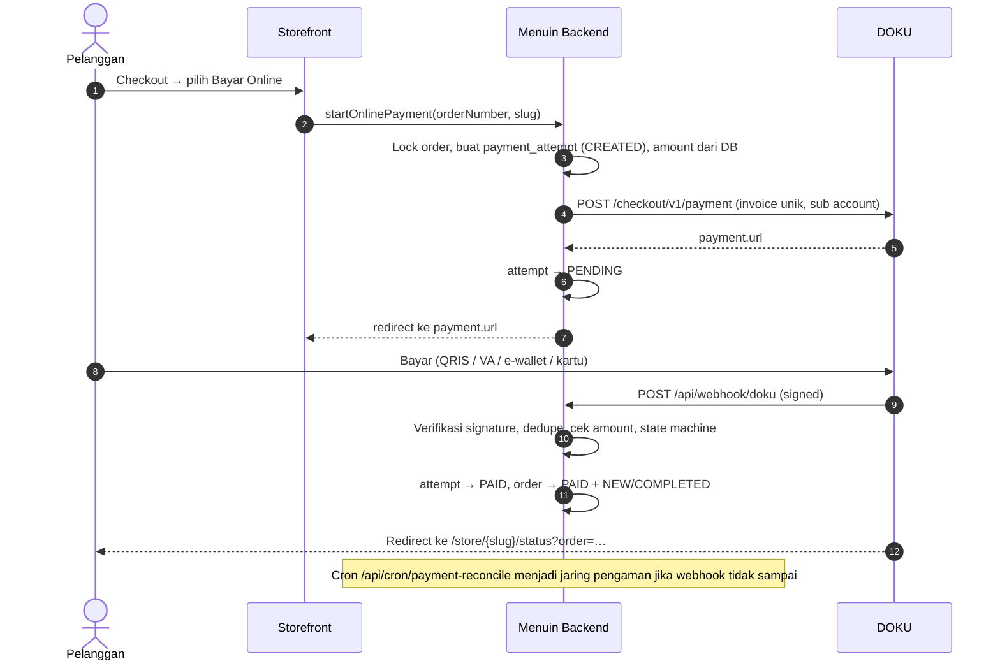

# Menuin × DOKU — Source of Truth Integrasi Pembayaran

Dokumen acuan teknis integrasi DOKU di Menuin. Isinya mengikuti kode yang sudah
ada di repo; bila ada perbedaan, **kode adalah sumber kebenaran** dan dokumen ini
harus diperbarui.

---

## 1. Keputusan arsitektur

| Keputusan | Pilihan | Alasan |
|---|---|---|
| Model akun | **Platform + Sub Account** (Model A) | Menuin memegang satu kredensial DOKU (env). Tiap outlet cukup punya `doku_sub_account_id`, tidak ada secret per tenant di DB. |
| Produk untuk pesanan online (storefront) | **DOKU Checkout** (hosted page, Non-SNAP) | Satu integrasi untuk QRIS, VA, e-wallet, dan kartu. |
| POS QRIS dinamis | **SNAP QRIS MPM** (Fase 3) | Kasir butuh QR string mentah. Checkout hanya memberi URL. |
| Lingkungan | **Sandbox dulu** sampai semua fase selesai | Pindah ke production cukup dengan mengganti env. |

## 2. Status fase

| Fase | Isi | Status |
|---|---|---|
| 1 | Modul `lib/payments`, migrasi DB, Checkout storefront, webhook, cron rekonsiliasi, aktivasi Sub Account | ✅ Selesai (menunggu uji live di sandbox) |
| 2 | Subscription Menuin via DOKU (menggantikan `/api/checkout` + webhook Midtrans subscription) | ⏳ |
| 3 | POS QRIS dinamis via SNAP (RSA key pair, token B2B) | ⏳ |
| 4 | Rekonsiliasi settlement (fee riil), refund, dashboard review | ⏳ |

## 3. Alur pembayaran (Fase 1)



## 4. Peta kode

| File | Fungsi |
|---|---|
| `apps/web/src/lib/payments/doku/config.ts` | Membaca env dan memvalidasinya dengan zod. Fail-closed: tanpa kredensial, pembayaran online nonaktif. |
| `apps/web/src/lib/payments/doku/signature.ts` | Signature Non-SNAP (HMAC-SHA256 + Digest) dengan perbandingan constant-time. |
| `apps/web/src/lib/payments/doku/client.ts` | HTTP client: timeout, `Request-Id` unik, error API vs network (outcome unknown). |
| `apps/web/src/lib/payments/doku/checkout.ts` | Create Checkout dan Check Status. |
| `apps/web/src/lib/payments/doku/sub-account.ts` | Membuat Sub Account outlet. |
| `apps/web/src/lib/payments/doku/notification.ts` | Parsing header dan payload webhook. |
| `apps/web/src/lib/payments/state-machine.ts` | Aturan transisi status (murni, diuji unit). |
| `apps/web/src/lib/payments/payment.service.ts` | Create, apply outcome, sync, webhook, dan rekonsiliasi. Satu-satunya pintu ke DB pembayaran. |
| `apps/web/src/app/api/webhook/doku/route.ts` | Endpoint notifikasi DOKU. |
| `apps/web/src/app/api/cron/payment-reconcile/route.ts` | Endpoint cron rekonsiliasi. |
| `apps/web/drizzle/doku_payments.sql` + `scripts/migrate-doku-payments.mjs` | Migrasi DB (idempotent). |

## 5. Spesifikasi DOKU yang dipakai

**Base URL:** sandbox `https://api-sandbox.doku.com`, production `https://api.doku.com`.

**Signature Non-SNAP** (untuk request keluar maupun webhook masuk):
```
Component = "Client-Id:{id}\nRequest-Id:{rid}\nRequest-Timestamp:{ts}\nRequest-Target:{path}"
            + "\nDigest:{base64(sha256(rawBody))}"   (hanya jika ada body)
Signature = "HMACSHA256=" + base64(HMAC-SHA256(secretKey, Component))
```
- `Request-Timestamp`: ISO-8601 UTC tanpa milidetik, contoh `2026-09-30T08:00:00Z`.
- Untuk webhook, `Request-Target` = **path notification URL milik Menuin** (`DOKU_NOTIFICATION_PATH`, default `/api/webhook/doku`).
- Digest dihitung dari **body mentah**. Body tidak boleh di-parse lalu di-stringify ulang sebelum diverifikasi.

**Endpoint:**
| Aksi | Endpoint |
|---|---|
| Buat pembayaran | `POST /checkout/v1/payment`, lalu ambil `response.payment.url` |
| Cek status | `GET /orders/v1/status/{invoice_number}`, lalu baca `transaction.status` |
| Buat Sub Account | `POST /sac-merchant/v1/accounts`, lalu ambil `account.id` (`SAC-…`) |
| Routing dana ke outlet | tambahkan `additional_info.account.id = "SAC-…"` di request Checkout |

**Pemetaan status:** `SUCCESS → PAID`, `PENDING → PENDING`, `FAILED → FAILED`, `EXPIRED → EXPIRED`. Status lain diabaikan.

## 6. Data

**`payment_attempts`**: satu baris per percobaan bayar.
- `invoice_number` unik per attempt, format `MNU-{time36}-{rand}`.
- `amount` berupa integer rupiah.
- Status: `CREATED → PENDING → PAID | FAILED | EXPIRED | CANCELED`.
- Unique index parsial menjamin **maksimal satu attempt aktif per order**.
- Kolom review: `requires_review` dan `review_reason` (`LATE_PAYMENT`, `ALREADY_PAID_OTHER_METHOD`, `ORDER_CLOSED_BEFORE_PAYMENT`, `AMOUNT_MISMATCH`, `SUB_ACCOUNT_MISMATCH`).
- `fee_amount`/`net_amount` untuk sementara berupa estimasi (`fee_source = ESTIMATED`, 0,7%) sampai rekonsiliasi settlement di Fase 4.

**`payment_webhook_events`**: log mentah notifikasi. Unik per `(provider, request_id)`, dipakai untuk dedupe, audit, dan replay.

**`tenants`**: `doku_sub_account_id` dan `doku_sub_account_status`. Kolom `doku_client_id`, `doku_secret_key`, dan `doku_environment` adalah legacy dan tidak dipakai.

**`transactions`**: `gateway_fee` dan `net_amount` baru diisi saat pembayaran online **sukses**. Saat order dibuat, nilainya 0 dan grand total.

## 7. Aturan penanganan kondisi

| Kondisi | Perilaku |
|---|---|
| Pelanggan klik "Bayar" berkali-kali atau paralel | Row order dikunci dan attempt aktif dipakai ulang. Tidak pernah ada invoice ganda. |
| Webhook dikirim ulang (Request-Id sama) | 200 `duplicate`, tanpa efek. |
| Webhook sukses dengan Request-Id baru untuk invoice yang sudah PAID | `NO_CHANGE` (state machine). |
| Webhook dan cek status datang bersamaan | Lock baris `transactions` lalu `payment_attempts` (urutan tetap), sehingga hanya satu yang mencatat. |
| Amount di webhook ≠ amount attempt | **Tidak** ditandai PAID, diberi flag `AMOUNT_MISMATCH`. |
| Signature salah atau Client-Id beda | 401, tidak menyentuh DB. |
| Invoice tidak dikenal | 200 dan dicatat (agar DOKU tidak retry tanpa henti). |
| Error DB saat memproses webhook | 500, event belum ditandai processed, DOKU akan retry. |
| Bayar setelah attempt expired atau pelanggan pindah ke tunai | Tetap dicatat PAID, `paymentMethod` kembali `ONLINE`, flag `LATE_PAYMENT`. |
| Order sudah dibayar tunai lalu uang online masuk | Order tidak diubah, attempt diberi flag `ALREADY_PAID_OTHER_METHOD` (perlu refund manual). |
| Order dibatalkan lalu uang masuk | `paymentStatus = PAID`, status order tetap batal, flag `ORDER_CLOSED_BEFORE_PAYMENT`. |
| Timeout saat create ke DOKU | Attempt `FAILED` dengan catatan `[outcome unknown]`, pelanggan bisa coba lagi. |
| Webhook tidak pernah datang | Cron memanggil Check Status. Kalau lewat batas waktu + 30 menit, attempt ditandai `EXPIRED`. |
| Attempt macet di `CREATED` lebih dari 5 menit | Cron menandainya `FAILED`. |
| Halaman status di-polling pelanggan | Cek ke DOKU dibatasi minimal 15 detik per attempt. Tombol kasir dibatasi 5 detik. |
| Callback URL | Dibangun di server dari `APP_BASE_URL` (bukan dari client), untuk mencegah open redirect. |

## 8. Konfigurasi (env server)

| Variabel | Wajib | Keterangan |
|---|---|---|
| `DOKU_ENV` | ✅ | `sandbox` / `production` |
| `DOKU_CLIENT_ID` | ✅ | Client ID dari dashboard DOKU (`BRN-…`) |
| `DOKU_SECRET_KEY` | ✅ | Secret Key (`SK-…`) |
| `DOKU_NOTIFICATION_PATH` | – | Default `/api/webhook/doku` |
| `DOKU_REQUIRE_SUB_ACCOUNT` | – | Default `true` di production, `false` di sandbox |
| `DOKU_PAYMENT_DUE_MINUTES` | – | Default `15` |
| `DOKU_ESTIMATED_MDR_PERCENT` | – | Default `0.7` |
| `APP_BASE_URL` | disarankan | Origin publik, mis. `https://app.menuin.id` |
| `CRON_SECRET` | ✅ untuk cron | Header `Authorization: Bearer <CRON_SECRET>` |

Kredensial **tidak boleh** di-commit, ditempel di chat, atau disimpan di DB. Gunakan secret manager atau env deployment.

## 9. Setup sandbox

1. Isi env di atas di deployment (dan di `.env.local` untuk dev).
2. Jalankan migrasi: `DATABASE_URL=… npm run db:migrate:doku --workspace=web`.
3. Di dashboard DOKU sandbox, set **Notification URL** ke `https://<domain>/api/webhook/doku`. Untuk dev lokal, pakai tunnel HTTPS (ngrok atau cloudflared).
4. Minta DOKU mengaktifkan **Checkout** dan **Sub Account** di akun sandbox kalau belum aktif.
5. Jadwalkan cron `GET /api/cron/payment-reconcile` setiap 5 menit dengan header Authorization. Bisa lewat Vercel Cron (paket Pro), Supabase `pg_cron` + `pg_net`, atau scheduler eksternal.
6. Sebagai OWNER: buka **Pengaturan → Pembayaran Online → Aktifkan Akun Pembayaran** (membuat Sub Account), lalu aktifkan **Katalog → Pemesanan → Pembayaran Non-Tunai**.

## 10. Checklist uji sandbox (end-to-end)

- [ ] Bayar sukses via simulator (QRIS dan VA): order menjadi PAID dan masuk antrean dapur, fee estimasi tercatat.
- [ ] Klik "Bayar Sekarang" berulang: URL yang sama dipakai ulang.
- [ ] Biarkan expired: attempt EXPIRED, bayar ulang membuat invoice baru.
- [ ] Pindah ke "Bayar di Kasir" lalu tetap bayar online: PAID dengan flag `LATE_PAYMENT`.
- [ ] Kirim ulang notifikasi dari dashboard DOKU: tidak ada pencatatan ganda.
- [ ] Kirim notifikasi palsu (signature salah): 401.
- [ ] Matikan webhook (URL salah) lalu jalankan cron: status tetap tersinkron.
- [ ] Dana masuk ke Sub Account outlet yang benar (cek `additional_info.account.id`).

## 11. Pengujian otomatis

```bash
npm test --workspace=web                                   # unit test (tanpa DB)
TEST_DATABASE_URL=postgres://… npm test --workspace=web    # + integration test ke Postgres uji
```
Integration test membutuhkan database **uji** yang sudah berisi skema dan migrasi. Jangan arahkan ke DB produksi.

## 12. Go-live (setelah semua fase lulus di sandbox)

1. Lengkapi dokumen legal dan kontrak platform dengan DOKU.
2. Buat kredensial production **baru**. Jangan pakai ulang kredensial yang pernah dibagikan.
3. Ganti env ke production (`DOKU_ENV=production`, key production). `DOKU_REQUIRE_SUB_ACCOUNT` otomatis `true`.
4. Daftarkan Notification URL production, lalu buat Sub Account production untuk tiap outlet.
5. Pantau log `scope=payments` dan attempt dengan `requires_review = true`.
